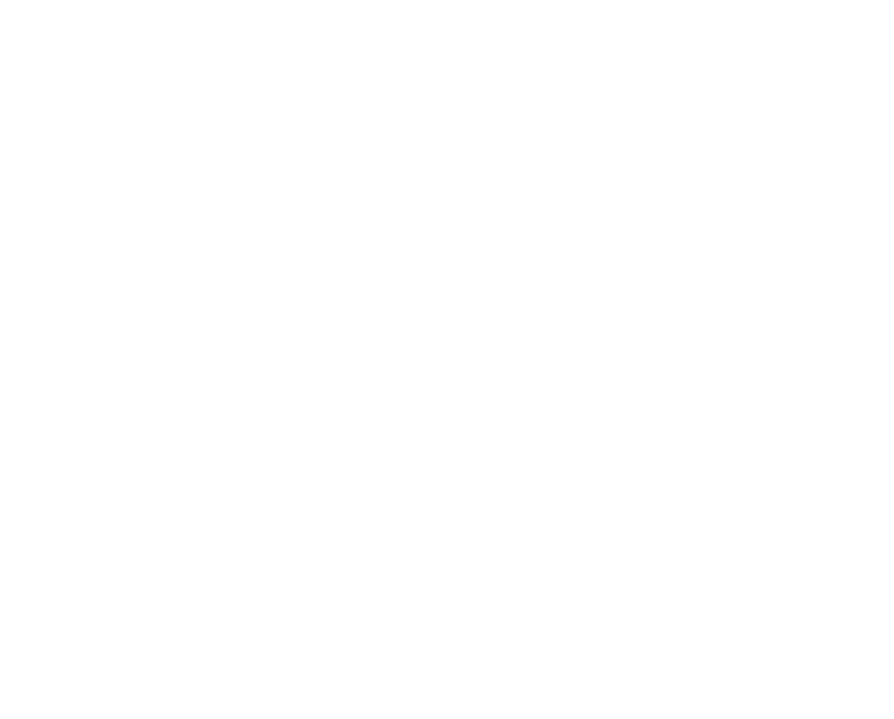
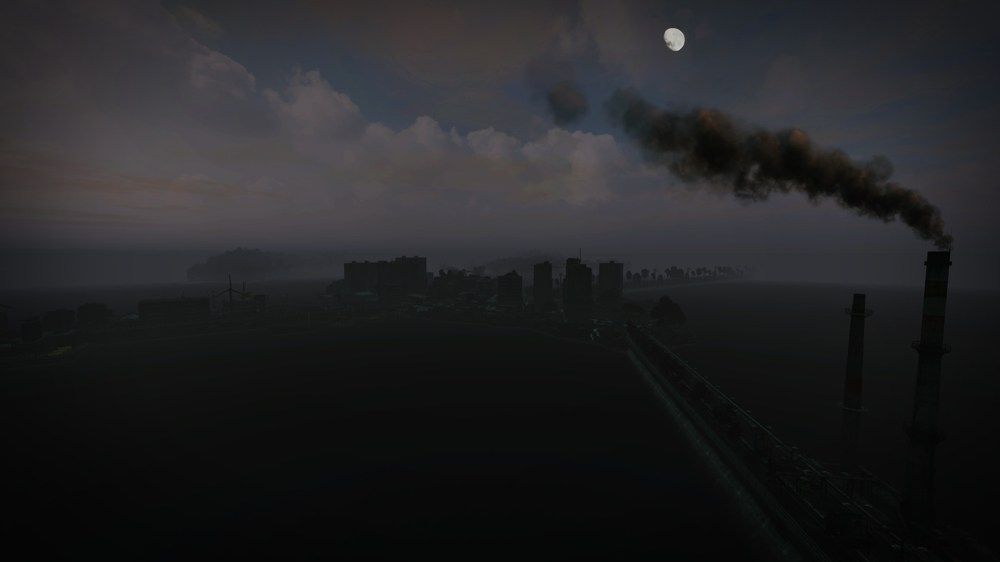
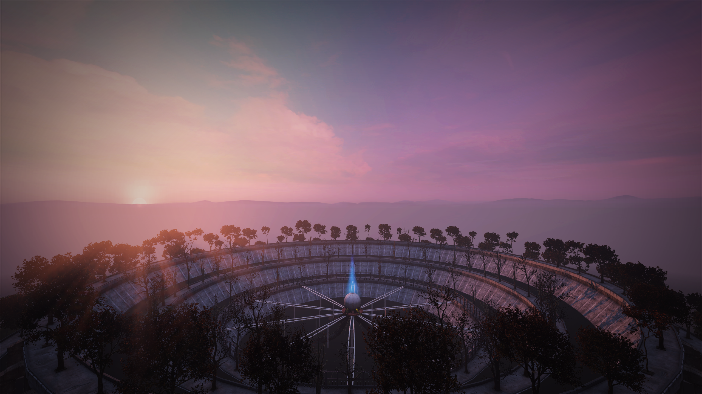

# Hashima Islands 端島 — Brand Kit

Brand Kit for Hashima Islands, a DayZ Modded Map inspired by Hashima, commonly called Gunkanjima (meaning Battleship Island), an abandoned island off Nagasaki.

#### [Visit Website 🡥](https://hashima.gg)

---

## Brand

### Hashima Islands

<table>
  <tr>
    <td>
      
    </td>
    <td>
      
    </td>
  </tr>
  <tr>
    <td>
      <strong>
        <a href="https://github.com/hashimagg/brand/raw/main/brand/svg-hashima_icon_1024_transparent.svg" target="_blank">.SVG 🡥</a>
      </strong> /
      <strong>
        <a href="https://github.com/hashimagg/brand/raw/main/brand/png-hashima_icon_1024_transparent.png" target="_blank">.PNG 🡥</a>
      </strong>
    </td>
    <td>
      <strong>
        <a href="https://github.com/hashimagg/brand/raw/main/brand/svg-hashima_logo_1024_black.svg" target="_blank">.SVG 🡥</a>
      </strong> /
      <strong>
        <a href="https://github.com/hashimagg/brand/raw/main/brand/png-hashima_logo_1024_black.png" target="_blank">.PNG 🡥</a>
      </strong>
    </td>
  </tr>
</table>

<table>
  <tr style="background-color: #000000">
    <td>
       
    </td>
    <td>
       
    </td>
  </tr>
  <tr style="background-color: #000000">
    <td>
      <strong>
        <a href="https://github.com/hashimagg/brand/raw/main/brand/svg-hashima_icon_1024_transparent.svg" target="_blank">.SVG 🡥</a>
      </strong> /
      <strong>
        <a href="https://github.com/hashimagg/brand/raw/main/brand/png-hashima_icon_1024_transparent.png" target="_blank">.PNG 🡥</a>
      </strong>
    </td>
    <td>
      <strong>
        <a href="https://github.com/hashimagg/brand/raw/main/brand/svg-hashima_logo_1024_white.svg" target="_blank">.SVG 🡥</a>
      </strong> /
      <strong>
        <a href="https://github.com/hashimagg/brand/raw/main/brand/png-hashima_logo_1024_white.png" target="_blank">.PNG 🡥</a>
      </strong>
    </td>
  </tr>
</table>

---

### CreepyCrappyShow — Loop

<table>
  <tr>
    <td></td>
    <td></td>
  </tr>
  <tr>
    <td>
      <strong>
        <a href="https://github.com/hashimagg/brand/raw/main/brand/gif-ccs_icon_400_loop_transparent.gif" target="_blank">.GIF 🡥</a>
      </strong> /
      <strong>
        <a href="https://github.com/hashimagg/brand/raw/main/brand/png-ccs_icon_400_transparent.png" target="_blank">.PNG 🡥</a>
      </strong>
    </td>
    <td>
      <strong>
        <a href="https://github.com/hashimagg/brand/raw/main/brand/svg-ccs_logo_1024_black.svg" target="_blank">.SVG 🡥</a>
      </strong> /
      <strong>
        <a href="https://github.com/hashimagg/brand/raw/main/brand/png-ccs_logo_1024_black.png" target="_blank">.PNG 🡥</a>
      </strong>
    </td>
  </tr>
</table>

<table>
  <tr style="background-color: #000000">
    <td></td>
    <td></td>
  </tr>
  <tr style="background-color: #000000">
    <td>
      <strong>
        <a href="https://github.com/hashimagg/brand/raw/main/brand/gif-ccs_icon_400_loop_transparent.gif" target="_blank">.GIF 🡥</a>
      </strong> /
      <strong>
        <a href="https://github.com/hashimagg/brand/raw/main/brand/png-ccs_icon_400_transparent.png" target="_blank">.PNG 🡥</a>
      </strong>
    </td>
    <td>
      <strong>
        <a href="https://github.com/hashimagg/brand/raw/main/brand/svg-ccs_logo_1024_white.svg" target="_blank">.SVG 🡥</a>
      </strong> /
      <strong>
        <a href="https://github.com/hashimagg/brand/raw/main/brand/png-ccs_logo_1024_white.png" target="_blank">.PNG 🡥</a>
      </strong>
    </td>
  </tr>
</table>

---

### CreepyCrappyShow — Pause

<table>
  <tr>
    <td></td>
    <td></td>
  </tr>
  <tr>
    <td>
      <strong>
        <a href="https://github.com/hashimagg/brand/raw/main/brand/gif-ccs_icon_400_pause_transparent.gif" target="_blank">.GIF 🡥</a>
      </strong> /
      <strong>
        <a href="https://github.com/hashimagg/brand/raw/main/brand/png-ccs_icon_400_transparent.png" target="_blank">.PNG 🡥</a>
      </strong>
    </td>
    <td>
      <strong>
        <a href="https://github.com/hashimagg/brand/raw/main/brand/svg-ccs_logo_1024_black.svg" target="_blank">.SVG 🡥</a>
      </strong> /
      <strong>
        <a href="https://github.com/hashimagg/brand/raw/main/brand/png-ccs_logo_1024_black.png" target="_blank">.PNG 🡥</a>
      </strong>
    </td>
  </tr>
</table>

<table>
  <tr style="background-color: #000000">
    <td></td>
    <td></td>
  </tr>
  <tr style="background-color: #000000">
    <td>
      <strong>
        <a href="https://github.com/hashimagg/brand/raw/main/brand/gif-ccs_icon_400_pause_transparent.gif" target="_blank">.GIF 🡥</a>
      </strong> /
      <strong>
        <a href="https://github.com/hashimagg/brand/raw/main/brand/png-ccs_icon_400_transparent.png" target="_blank">.PNG 🡥</a>
      </strong>
    </td>
    <td>
      <strong>
        <a href="https://github.com/hashimagg/brand/raw/main/brand/svg-ccs_logo_1024_white.svg" target="_blank">.SVG 🡥</a>
      </strong> /
      <strong>
        <a href="https://github.com/hashimagg/brand/raw/main/brand/png-ccs_logo_1024_white.png" target="_blank">.PNG 🡥</a>
      </strong>
    </td>
  </tr>
</table>

---

## Typography

**Hashima Islands:** **[Kosugi Maru 🡥](https://fonts.google.com/specimen/Kosugi+Maru)** Designed by MOTOYA

**CreepyCrappyShow:** **[Clarendon 🡥](https://fonts.adobe.com/fonts/clarendon-text)** Designed by Patrick Griffin

</small>

---

## Screenshots

---

## Disclaimer

Hashima Islands is based on real history and real terrains. However, some aspects of the content have been fictionalized for the purposes of gameplay. I do not claim ownership over any copyrighted material that may be present in Hashima Islands. All copyrighted material belongs to their respective owners. This mod is intended for personal and non-commercial use only. I'm not responsible for any damage that may occur to your game while using this mod. Use at your own risk.

---

<small>

**[HASHIMA.GG](https://hashima.gg)** — **[Join the Discord](https://discord.gg/Uap8rwekfA)**